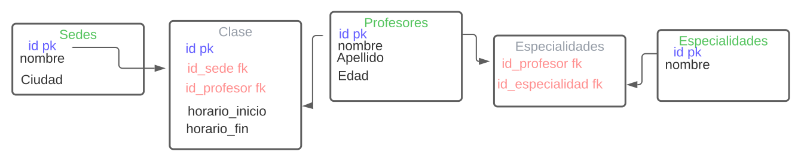

# Proyecto Final

El gym fitnes plan requiere un sistema para poder programar la clase grama, teniendo en cuenta que el gym tiene varias sedes por lo cual es necesario identificar la sede y su ciudad de ubicación, para esto requiere tener registrados los profesores y sus especialidades, los horarios que estos están disponibles.

